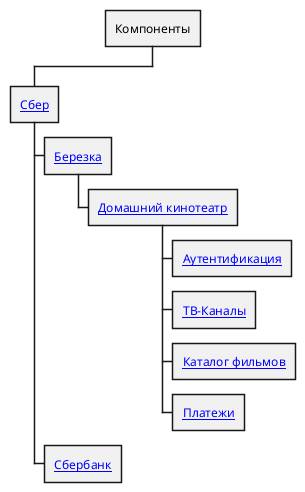

# ООО Березка
Пример описания корпоративной архитектуры с использованием специализированного 
фреймворка [SEAF.DZO](./_metamodel_/seaf-dzo/README.md).

## Развертывание

1. Установите DocHub используя [инструкцию](https://github.com/RabotaRu/DocHub#быстрый-старт). Рекомендуется использовать вариант развертывания - плагин для IDEA; 
2. Клонируйте данный репозиторий;
3. Откройте проект в IDE.

## Состав поставки

```

|- _metamodel_      - Пакеты расширений
|  |- hexagon       - Расширение для создания метамоделей без использования JSONata
|  |- iaas          - Расширение для отображения технической архитектуры полученной по API от IaaS провайдеров
|  |- seaf-core     - Sber Enterprise Architecture Framework (SEAF)
|  |- seaf-dzo      - Специализированное расширение SEAF для ДЗО
|- architecture     - Пример описания архитектуры 
|  |- app           - Прикладная архитектура
|  |- ba            - Бизнес-архитектура (TBD)
|  |- ia            - Информационная архитектура (TBD)
|  |- ta            - Техническая архитектура 
|- docs             - Документация
|- dochub.yaml      - Корневой манифест 
|- README.md        - Описание репозитория

```



## Лицензия

Распространяется под лицензией Apache License 2.0 Open source license.


