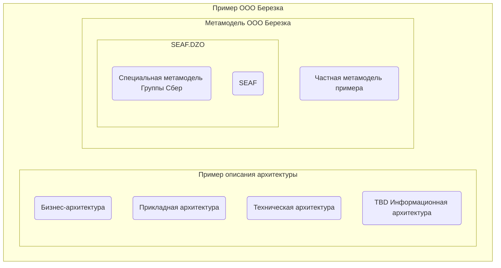

# ООО Березка
Пример описания корпоративной архитектуры с использованием специализированного 
фреймворка [SEAF.DZO](./_metamodel_/seaf-dzo/README.md) основанного на [SEAF](./_metamodel_/seaf-core/README.md).



## Развертывание

1. Установите DocHub используя [инструкцию](https://github.com/RabotaRu/DocHub#быстрый-старт). 
   Для ознакомления, рекомендуется использовать вариант развертывания - плагин для IDEA; 
2. Клонируйте данный репозиторий;
3. Откройте проект в IDE.

**ВНИМАНИЕ:**
 Рекомендуется использовать плагин IDEA версии 3.10.0 и выше!

## Структура меню
```

|- Документы                - Информация о поставке
|  |- SEAF                  - Документация по базовому фреймворку SEAF
|  |- SEAF.DZO              - Документация по специализировнному для ДЗО фреймворку SEAF
|  |- Hexagon               - Документация по расширению Hexagon
|  |- IAAS                  - Докумнтация по IaaS реверс-архитектуре
|- Метамодель               - Статистика по метамодели
|  |- Общая                 - Полная визуализация метамодели
|  |- Прикладная            - Метамодель прикладной архитектуры
|  |- Техническая           - Метамодель технической архитектуры
|- Архитектура              - Пример архитектурного описания ООО Березка
|  |- Бизнес-архитектура    - Бизнес-слой
|  |- Прикладная            - Прикладной слой
|  |- Техническая           - Технический слой
|  |- IAAS                  - Пример рверс-архитектуры из SberCloud
|- Анализ                   - Бизнес и системный анализ
|  |- Требования            - Требования (бизнес/функциональные/нефункциональные)
```

## Состав поставки

```

|- _metamodel_      - Пакеты расширений
|  |- hexagon       - Расширение для создания метамоделей без использования JSONata
|  |- iaas          - Расширение для отображения технической архитектуры полученной по API от IaaS провайдеров
|  |- mm-descovery  - Расширение для изуализации метамодели
|  |- seaf-core     - Sber Enterprise Architecture Framework (SEAF)
|  |- seaf-dzo      - Специализированное расширение SEAF для ДЗО
|- architecture     - Пример описания архитектуры 
|  |- app           - Прикладная архитектура
|  |- ba            - Бизнес-архитектура (TBD)
|  |- ia            - Информационная архитектура (TBD)
|  |- ta            - Техническая архитектура 
|  |- tools         - Конфигурации инструментария для анализа архитектуры (mm-discovery)
|  |- interface     - Конфигурация пользовательского интерфейса 
|- docs             - Документация
|- dochub.yaml      - Корневой манифест 
|- README.md        - Описание репозитория

```

## Лицензия

Распространяется под лицензией Apache License 2.0 Open source license.

