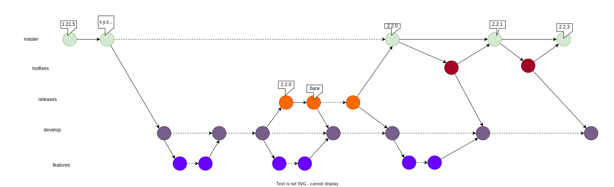
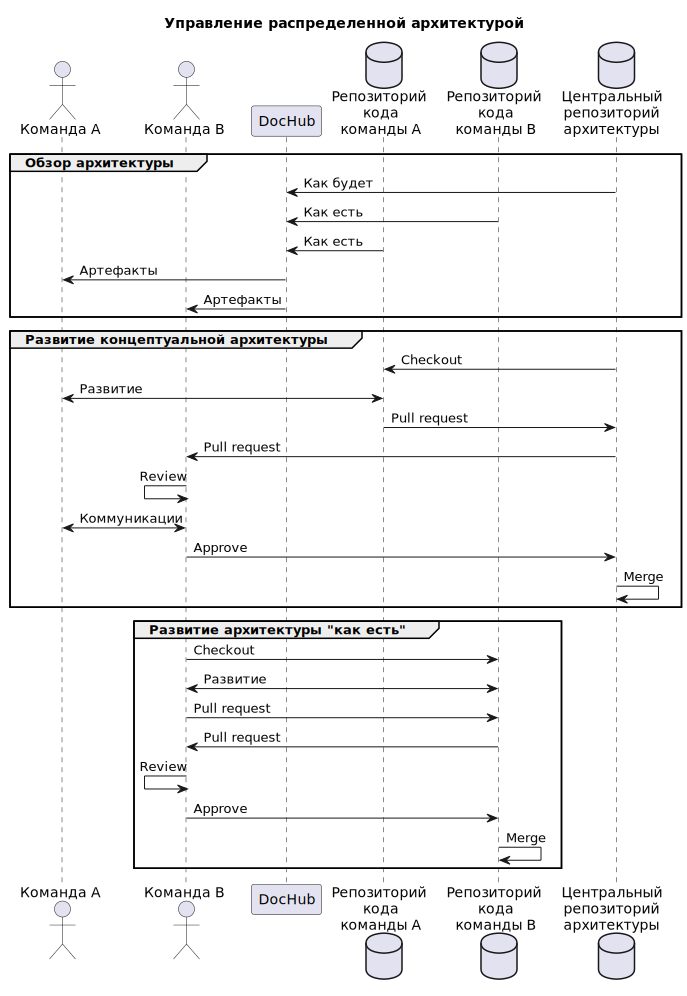

# SEAF
Sber Enterprise Architecture Framework (SEAF) - открытый и развиваемый сообществом экспертов-практиков 
архитектурный фреймворк в своей основе использующий подход "Архитектура как код".

## Манифест

1. Вклад сообщества в развитие фреймворка является наивысшей ценностью для нас.

2. Миссия сообщества SEAF - создание технологии цифровой моделей предприятия. Мы считаем, что достичь ее можно
   описывая архитектуру специальным кодом, поддающимся автоматизированному анализу.

3. Мы не противопоставляем SEAF другим фреймворкам. Наш принцип – использовать лучшее из них.

4. Мы считаем, что SEAF должен удовлетворять потребностям предприятий любого масштаба. Обеспечивать их ценностью
   на всех этапах развития.

5. Мы признаем, что архитектурная функция распределена между всеми участниками трансформаций, поэтому он основан
   на простоте и низком пороге входа для любого участника изменений. Наш фреймворк не требует выделенной роли архитектора.

6. Мы поставляем метамодель и методологию, которые должны адаптироваться и развиваться под потребности конкретного
   предприятия, выявленные домены и слои архитектуры.

7. Эти принципы мы создали на основе нашего успешного опыта управления архитектурой в Группе Сбер. Мы верим, что
   они наделяют SEAF уникальными способностями:
    * Cтимулировать инновации архитектурной функции;
    * Аккумулировать и распространять лучшие практики;
    * Создавать условия для коллаборации в сложных системах управления.

## Архитектура фреймворка
```

|--------------------------- 1. ФИЛОСОФИЯ ----------------------------|
|                                                                     |
|      [2. Подходы и принципы] [3. Ценности] [4. Протомодель]         |
|                                                                     |
| |-------- 5. ПОСТАВКА --------|  |-------- 11.СООБЩЕСТВО ---------| |
| | [6. Референсный инструмент] |  |  [12. Репозиторий фреймворка]  | |
| |      [7. Методология]       |  |  [13. Проф. гуруппы и каналы]  | |
| |    [8. Практики/кейсы]      |  | [14. Статьи, воркшопы, митапы] | |
| |  [9. Базовая метамодель]    |  |--------------------------------| |
| |     [10. Документация]      |                                     |
| |-----------------------------|                                     |
|                                                                     |
|---------------------------------------------------------------------|

```

* (1, 2, 3, 4) Философия фреймворка выражается в [манифесте](#манифест);
* (5) Под поставкой понимается выпуск очередного релиза фреймворка в форме repo;
* (6) В качестве референсного инструмента предлагается [DocHub](https://github.com/RabotaRu/DocHub);
* (7) Методология включается в виде документов в поставку;
* (8) Поставка содержит [пример](/entities/components/tree) описания архитектуры,
  а также предлагается репозиторий [примеров](https://github.com/rpiontik/DocHubExamples)
  применения подхода;
* (9) Входит в поставку;
* (10) Входит в поставку;
* (11) Сообщество обеспечивает развитие фреймворка и генерирует поставку;
* (12) [Репозиторий фреймворка])(https://github.com/RabotaRu/DocHub);
* (13) Группа сообщества развивающего подход управления архитектуры кодом [DocHubTeam](https://t.me/archascode);
* (14) [Статьи о развитии подхода](https://habr.com/ru/users/rpiontik/) и видео
  c [воркшопами и митапами](https://www.youtube.com/@user-eq5pj3zk6w).

## Соглашение по структуре архитектурных репозиториев
```
|- _metamodel_                 - Подключенные пакеты метамоделей
|  |- [название пакета]        - Пакет метамодели
|  |  |- entities              - Сущности метамодели
|  |  |  |- [...]              - Структура каталогов сущностей
|  |  |  |  |- template        - Шаблоны для презентаций
|  |  |- functions             - Запросы написанные на JSONata
|  |  |- docs                  - Документация по репозиторию
|  |  |- architecture          - Архитектурные объекты поставляемые с пакетом
|  |  |  |- app                - Прикладная архитектура
|  |  |  |- ba                 - Бизнес-архитектура
|  |  |  |- ta                 - Техническая архитектура
|  |  |  |- ia                 - Информационная архитектура
|  |  |- dochub.yaml           - Корневой манифест пакета
|  |  |- README.md             - Описание пакета
|  |  |- LICENSE               - Лицензия под которой распространяется пакет
|- architecture                - Архитектурные объекты
|  |- app                      - Архитектурные объекты
|  |- ba                       - Бизнес-архитектура
|  |- ta                       - Техническая архитектура
|  |- ia                       - Информационная архитектура
|- facades                     - Подключаемые внешние архитектурные объекты
|- README.md                   - Ключевая информация по репозиторию
|- dochub.yaml                 - Корневой манифест репозитория
```

Предлагаемая структура является рекомендуемой и может расширяться при необходимости.

# Соглашение по идентификации архитектурных объектов

1. Идентификаторы должны соответствовать принципу DDD (структурированные идентифкаторы);
2. Используются только строчные символы;
3. Для разделения домена используется символ - "."
4. Для разделения слов - "_";
5. Системные идентификаторы должны начинаться с "$";
6. В идентификаторах могу быть использованы только символы - a..z 0..9 "_" "." "$";
7. Идентификаторы должны отражать смысл и быть существительным.

**RegEx для идентификаторов:** ^\[a-z0-9_\$]\[a-z0-9_\$]\*(\.\[a-z0-9_\$]\[a-z0-9_\$]\*)*$

Предлагается следующая структура идентификаторов:
```
[зона www].[домен].**
```

Примеры:
```
info.dochub.frontend
ru.nalog.site_fns
ru.yandex.app.search
```

## Метамодель

### Базовый подход к формированию слоев


## Общая метамодель


## Процессы управления

### Управление кодовой базой архитектуры
В качестве базы процесса управления версиями кодом архитектур предлагается
использовать следующий flow:



Рекомендуется сегментировать кодовую базу в соответствии с логическими пространствами 
доменов управления, придерживаясь принципов федеративного управления архитектурой.
Например, создавать отдельные репозитории для команд.

Задачу консолидации репозиториев решает [референсный инструмент](https://github.com/RabotaRu/DocHub).



### Федеративное управление архитектурой


## Лицензия

Распространяется под лицензией Apache License 2.0 Open source license.


