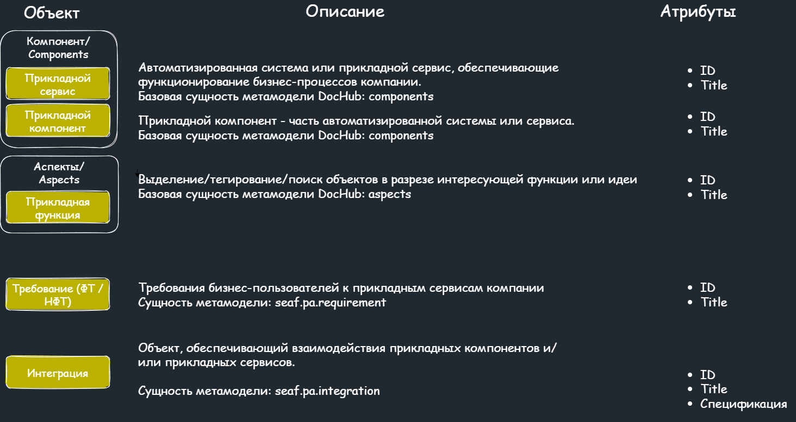
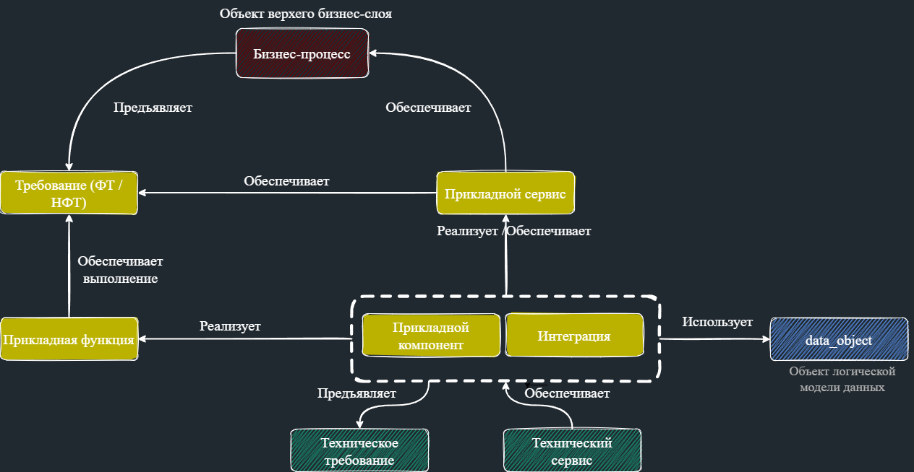
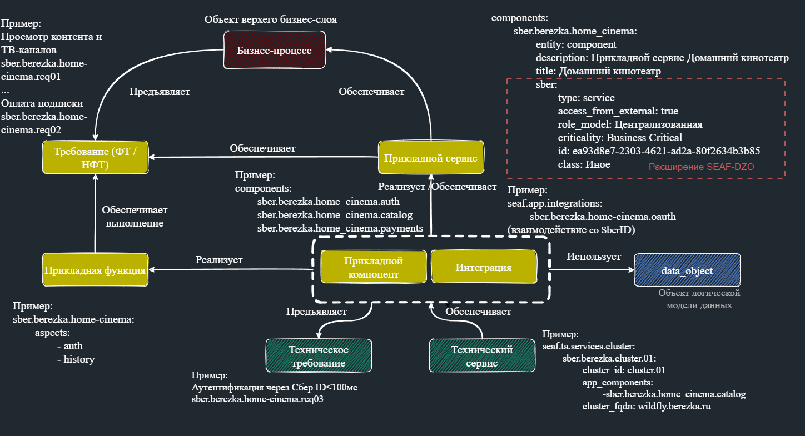

# Метамодель слоя "Прикладная архитектура"
Метамодель слоя прикладной архитектуры на текущий момент представлена метамоделью SEAF (SEAF CORE).
В перспективе (см. дрожную карту) предполагается расширение прикладного слоя сценарием автоматического описания прикладных сервисов из Gitlab и другими сценариями.
## Состав сущностей метамодели SEAF 
Прикладная архитектура строится на базе следующих сущностей:

## Метамодель SEAF прикладного слоя с внутренними связями
Прикладная архитектура описывается с учетом связей между сущностями:

## Пример описания прикладного слоя
В качестве примера описания архитектуры в метамодели SEAF можно использовать подключенный пример в каталоге architecture,
использующий базовые сущности, а также сущности и атрибутивный состав расширения SEAF.DZO (с использованием конструкции sber: в коде):

## Структура каталогов прикладной архитектуры
    -*-*-*-*-*-*-*-*-*-*-*-*-*-*-*-*-*-*-*-*-*-*-*-*-*-*-*-*-*-*-*-*-*-*-*-*-*-*-*-*-*-*-*-*-*-*-
    |- _metamodel_                      - Подключенные пакеты метамоделей
    |  |- seaf-core                     - Пакет seaf-core метамодели
    |  |  |- entities                   - Сущности метамодели
    |  |  |  |- app                     - Описание метамодели прикладной архитектуры
    |  |  |  |  |- integrations         - Описание сущностей интеграции прикладной архитектуры
    |  |  |  |  |- requirements         - Описание сущностей требований
    |  |  |  |  |- specifications       - Описание спецификации интеграции
    |  |  |  |  |- aspects.yaml         - Описание сущности аспектов
    |  |  |  |  |- components.yaml      - Описание компонентов прикладного слоя
    |  |  |  |  |- contexts.yaml        - Описание контекстов для выведения на диаграммы
    |- architecture                     - Архитектурные объекты поставляемые с пакетом
    |  |- app                           - Прикладная архитектура примера
    |  |  |- components.yaml            - Архитектура примера на прикладных компонентах
    |  |  |- contexts.yaml              - Архитектура примера в части контекстов
    |  |  |- functionality.yaml         - Архитектура примера в части функциональности
    |  |  |- integrations.yaml          - Архитектура примера в части интеграций
    |  |  |- requirements.yaml          - Архитектура примера в части требований
    |  |  |- services.yaml              - Архитектура примера в части сервисов

## Дорожная карта развития SEAF в слое прикладной архитектуры
В рамках работы с фокусными группами, набор и приоритеты разработки сценариев управления архитектурой с использованием объектной модели прикладного слоя, периодически пересматривается.
В настоящее время в числе сценариев развития SEAF в прикладном слое рассматриваются:
1. Автоматизированное описание прикладных сервисов из GitLab
2. Формирование портфеля приложений. Идентификация возможных источников автоматизированного описания прикладной архитектуры "как есть"