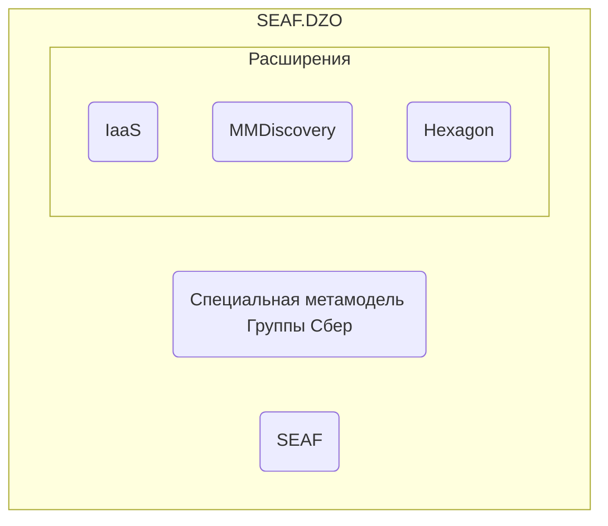

# SEAF.DZO
Архитектурный фреймворк ДЗО Группы Сбер, базирующийся на [SEAF (Sber Enterprise Architect Framefork)](../seaf-core/README.md).

Фреймворк адаптирует SEAF для использования в Группе, расширяя его поставку 
необходимым инструментарием и методологией для ДЗО. Обеспечивает однородность архитектурной
функции в Группе.

Структура фреймворка:


# Соглашение по идентификации архитектурных объектов в Группе

Идентификаторы архитектурных объектов должны соответствовать соглашению SEAF. 
При этом, на них накладывается дополнительные требования Группы.

Идентификаторы должны соответствовать структуре:
```
sber.[компания].**
```

Выделенный домен ДЗО можно выяснить у курирующего архитектора. 

Примеры:
```
sber.sberauto.server_virtual.server1
sber.enablers.component.sberid
sber.rabotaru.component.media_platform
```

## Лицензия

Распространяется под лицензией Apache License 2.0 Open source license.
