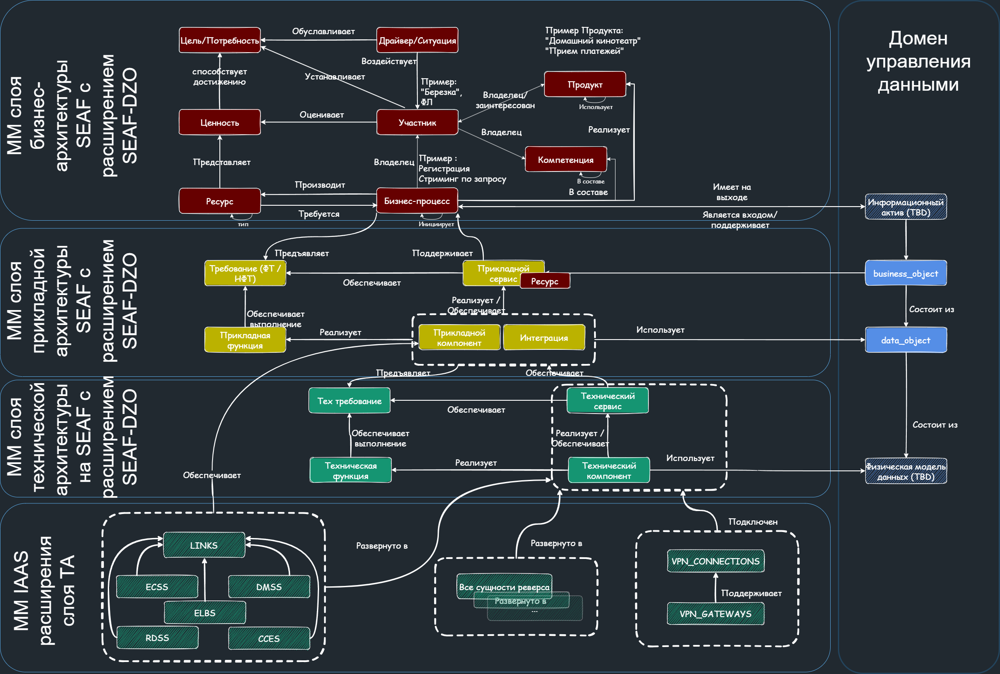

# SEAF.DZO
Специализированный под нужды ДЗО Группы Сбер архитектурный фреймворк 
основанный на [SEAF (Sber Enterprise Architect Framefork)](../seaf-core/README.md).

# Метамодель SEAF.DZO
Метамодель SEAF.DZO является расширением SEAF, которое можно использовать одновременно и с другими расширениями для отдельных задач.
Актуальная метамодель SEAF.DZO на базе SEAF представлена на рисунке.

Атрибутивный состав каждой сущности метамодели представлен в коде репозитория.
# Соглашение по идентификации архитектурных объектов в Группе

Идентификаторы архитектурных объектов, создаваемых на основе сущностей и атрибутивного состава метамодели, должны соответствовать соглашению о наименовании SEAF. 
При этом, на них накладывается дополнительные требования Группы.

Идентификаторы должны соответствовать структуре:
```
sber.[компания].**
```

Выделенный домен ДЗО можно выяснить у курирующего архитектора. 

Примеры:
```
sber.sberauto.server_virtual.server1
sber.enablers.component.sberid
sber.rabotaru.component.media_platform
```
# Дорожная карта развития SEAF.DZO
Дорожная карта развития и скоуп работ пересматриваются ежеквартально с участием фокусной группы развития SEAF.DZO.
Дорожная карта развития SEAF.DZO на 2024Q1 включает:
1. Завершение разработки slice pack, обеспечивающего формирование КА ДЗО
2. Разработку проверок форматно-логического контроля
3. Разработку проверок требований стандартов экосистемы


## Лицензия

Распространяется под лицензией Apache License 2.0 Open source license.
