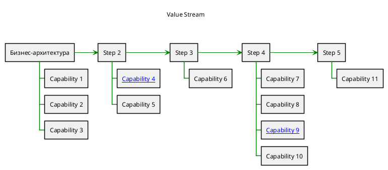

# Концептуальная метамодель

```plantuml
@startwbs
<style>
wbsDiagram {
  Linecolor black
  arrow {
    LineColor green
  }
  :depth(0) {
      BackgroundColor White
      RoundCorner 10
      LineColor white
  }
}
</style>

* Value Stream
** "Бизнес-архитектура" as step1
*** Capability 1
*** Capability 2
*** Capability 3
** "Step 2" as step2
*** [[http://mail.ru Capability 4]]
*** Capability 5
** "Step 3" as step3
*** Capability 6
** "Step 4" as step4
*** Capability 7
*** Capability 8
*** [[http://mail.ru Capability 9]]
*** Capability 10
** "Step 5" as step5
*** Capability 11
step1 -> step2: test
step2 -> step3
step3 -> step4
step4 -> step5
@endwbs
```
